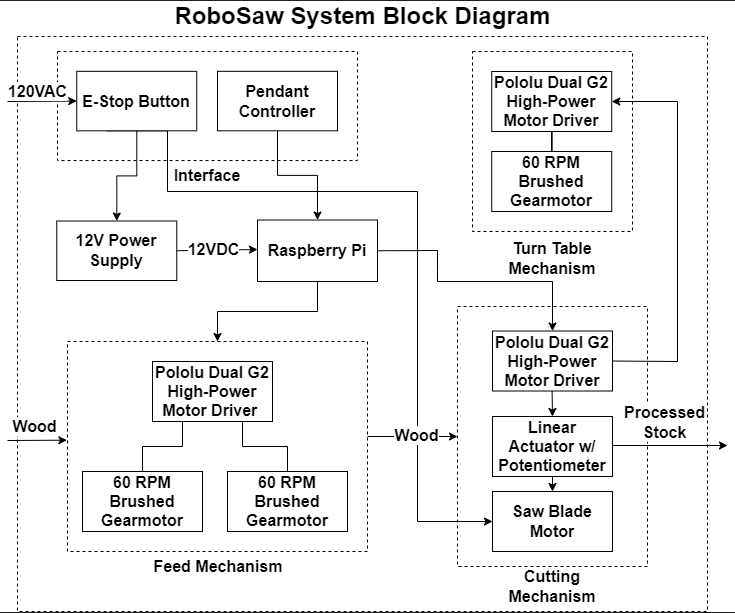
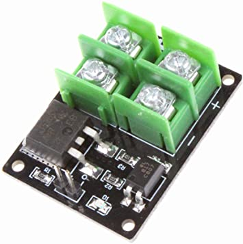

### Mechanical
RoboSaw uses a roller-intake mechanism to feed lumber through the frame and to the Metabo miter saw. The intake clamps the wood from the top using a steel roller arm attached to two pairs of 10 lb gas springs. The gas springs damp the intake so that it conforms around the wood without snapback if the wood is removed.

The saw 
The turntable mechanism, which allows the RoboSaw to perform angled cuts, is still a work in progress. Currently, the mechanism uses a rack and pinion gear setup. The rack is mounted to the stationary back of the miter saw turntable and the pinon is mounted to the front 

## RoboSaw Frame

The frame of the RoboSaw is constructed from 32 feet of 1.5 inch 80/20 stock. The 80/20 was secured together using various 80/20 fasteners. This frame allows us to mount the Metabo saw along with the intake mechanism. The 80/20 made the frame rigid to support large pieces of wood. The most important part of the 80/20 is it allows us to mount new components and mechanisms easily.  

## RoboSaw Stand

The RoboSaw stand was purchased from Home Depot. The stand was the DeWalt Rolling Miter Saw Stand. The 80/20 frame was mounted to this stand. It allowed us to lower and raise the entire saw. Moving the saw became much easier because when it is in the lowered position it can be rolled around similar to a dolly.

## RoboSaw Blade Actuation Mechanism
This section will describe the RoboSaw Actuation Mechanism and its various components. This mechanism is responsible for performing the cut quickly and safely.

### Hardware
The RoboSaw Blade Actuation mechanism is comprised all aluminum components. These were either ordered or milled in the EPIC facilities using the provided CAD and CAM files.

Parts included in the CAD:
 
1. Plate.SLDPRT-The main structural component of the mechanism

2. 2313N39_Corner Machine Bracket.STEP - Right angled bracket connected the the components together.

3. Actuator_Mount.SLDPRT- The component the linear actuator attaches to.

All of the screws, bolts, and nuts can be found in the Bill of Materials for the LInear Actuator Mechanism.

### Notes for Assembly

- Both Plate.SLDPRT and the Actuator_Mount.SLDPRT were milled out of 3/8 inch aluminum. This was done to increase the rigidity of the entire mechanism during the cutting process.

- The mounting plate was mounted using existing holes  and threads on the stock saw. We mounted the plate using a 3/8-16 X 5 inch bolt through the center hinge of the saw and a 5/16-18 X 1 inch screw.

- All of the milled components and linear actuator mount were secured together using 1/2-20X1-1/2 inch screws and 1/2-20 nuts.

- The linear actuator was mounted using a mount purchased online to the Actuator_Mount.SLDPRT component. A M6X0.75mm, 40mm long screw was used to attach the other end of the linear actuator to an existing threaded hole on the saw.

- In order for the linear actuator to work properly, you must remove the stopper screw on the side that allows the saw to return to its original position. If this is not removed the linear actuator mechanism will experience high loads that can result in a bolt shearing, parts breaking, and potential injury.

## Power Requirements
RoboSaw requires two 120V 60Hz AC wall power outlets to operate, one for powering the 12V 20A DC power supply that powers all the RoboSaw electronics, and one for the 15A miter saw itself. Provided that the power draw does not exceed any load limitations, a future revision should combine the two cables and then reroute them internally once power reaches the RoboSaw.

## Emergency Stops and Saftey Features
The main emergency stop is located on the front of the machine, and is a hard cut to both the 12V supply and the 120V to the saw motor. The green and red buttons contorl the saw blade power independently of the 12V supply. If the blade doesn't spin, make sure the green button is pressed on the e-stop. 

The second and primary power switch is located on the pendant controller. The green ON and red OFF buttons toggle the power to the 12V supply, which powers the Raspberry Pi and all of the motors. Using the OFF button will cut power from the 12V supply, which will also disable the saw blade motor if it is running.

IMPORTANT NOTE: the power switch on the pendant controller does not physically disconnect the 120V wall power to the saw blade, it only physically disconnects the 12V supply. In practice, this is most likely never to be an issue and the saw will completely shut down as normal. However if for some reason the terminals on the ice cube relay fuse together and power is attempted to be cut using only the pendant controller, there is a possiblity that the saw motor may continue to spin. In this case, immediately trigger the main emergency stop button, which will guarantee a safe power off. 

## Electronics

Robosaw is based off of the Raspberry Pi computer. There are 2 Pololu Dual G2 High-Power Motor Driver HATs stacked on top of the Pi, one of which has had each motor pin remapped to support an additional 2 motors. Each HAT has a connection to the 12V supply via a 10A fuse block connected via XT30 connectors. The Pi recieves power from the regulated 5V supply on the Pololu HAT. 

### Motor Connection
Each motor connects via [3.5mm barrel connector](https://www.servocity.com/3-5mm-bullet-lead-fh-mc-300mm-length/) to its respective terminals on each HAT. The turn table motor is the only motor that has its encoder attached, which is connected to pins (TBD) on the Raspberry Pi.

### Saw Blade Relay
The base configuration of the Metabo saw directly feeds the 120V from the wall through a switch to the saw motor. For this reason, an 15A rated ice cube relay with a 12V coil was used to handle the high current requirements [datasheet here](https://www.mouser.com/datasheet/2/357/1/Legacy_782XBXM4L_12D_document-2925784.pdf). 

To control the 12V coil on the relay with the 3.3V from the raspberry pi, a [MOSFET switching module](https://www.amazon.com/dp/B07F5JPXYS?psc=1&ref=ppx_yo2ov_dt_b_product_details) was used.

### Linear Actuator Potentiomenter
The feedback on the linear actuator is a potentiometer, which means we need an analog input. The Raspberry Pi does not have an ADC input, meaning an external I2C breakout is required. The chosen ADC is a ADS1115 16-bit ADC with PGA, which is connected to the Raspberry Pi over I2C via pins 2 and 3.

### Pendant Controller

The Pendant controller has 2 connected buttons for user input alongside power ON and OFF buttons. Each button is wired directly to a GPIO pin on the rPi and the power buttons are spliced between the emergency stop and the fuse block.

