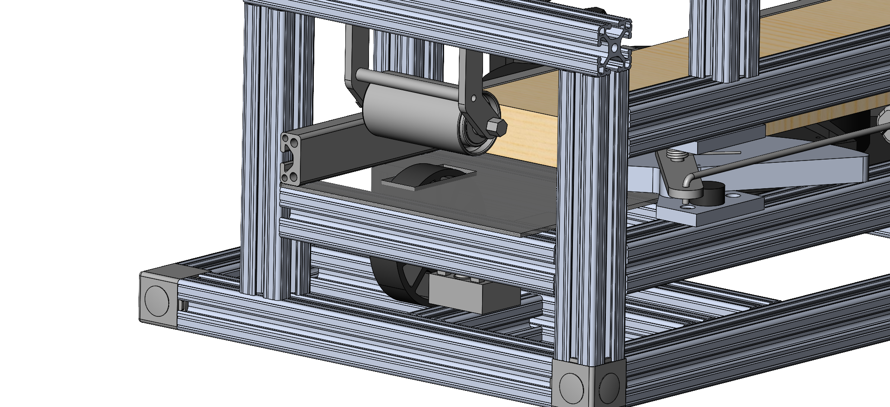
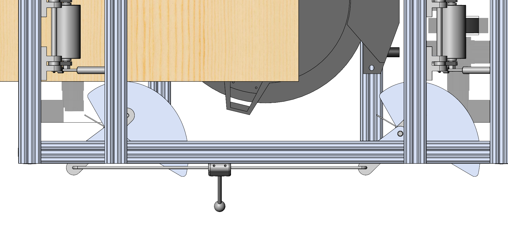

# Logbook Entry 01/14/22

## Logistics
- Ordered parts for new roller-intake
- Ordered all remaining electronics to power stepper motors for turntable mechanism, roller-intake, linear actuator and Raspberry Pi.
- Electronics consist of Pi hats that will be stacked on top of each other for convenience. Pins will be remapped as necessary.
- 3D printed new components for roller-intake and cam redesign at home.

## Design
- Designed new roller-intake mechanism as deemed necessary by testing. Motor is now mounted directly to the wheel the mechanism is stiffer and no skipping can occur.
- Acrylic bottom plates must be replaced because of the upgrade.
- Designed the lever mechanism to manually actuate cams and release wood stock from its fixed position.
- Decreased cam height to fix roller-intake meshing problem.

The updated roller-intake design.

The cam lever mechanism designed to allow the operator to manually remove woods stock from the intake once all cuts are completed. 

## Todo
- Assemble new roller-intake when the parts arrive and machine the new components in EPIC as necessary.